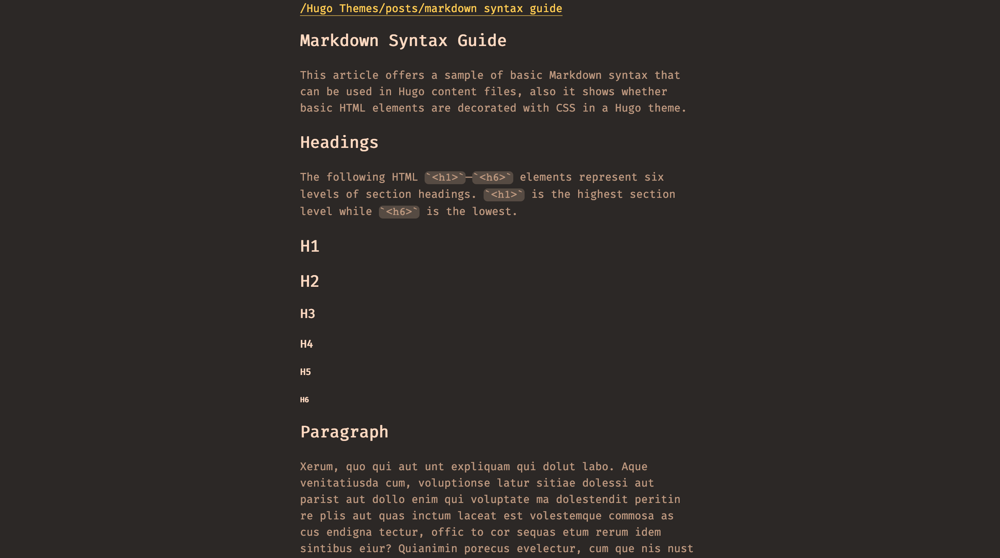
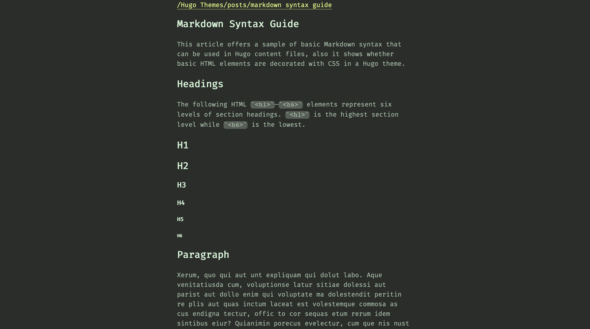
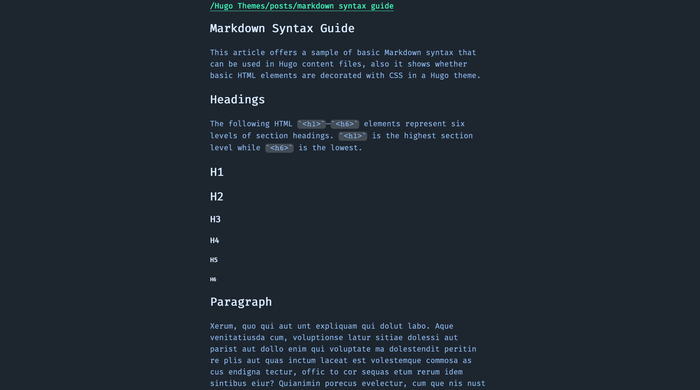
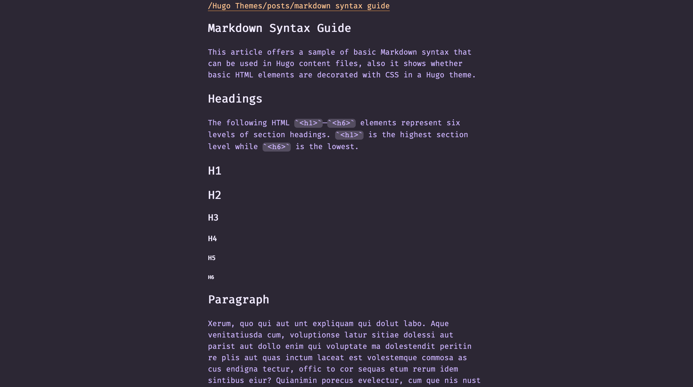
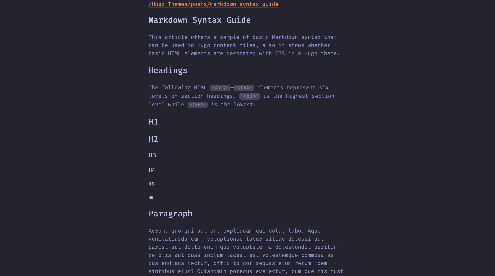

# Duotone Hugo Theme

A theme using Hack.css, based on the Duotone Dark theme for Atom / VSCode / terminals.
Very much a WIP.

In your config.toml, set the following value to specify a theme:

``` toml
[params]
    theme = "space"
```

## Screenshots







TODO:
- [x] Specify different themes
- [ ] Allow for default theme
- [x] Allow for custom homepage content
- [x] Change nav bar, make it like `pwd`
